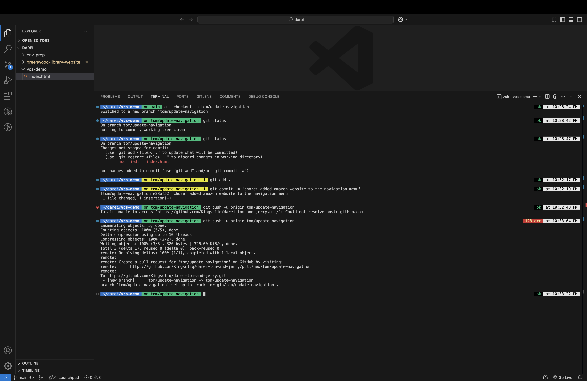
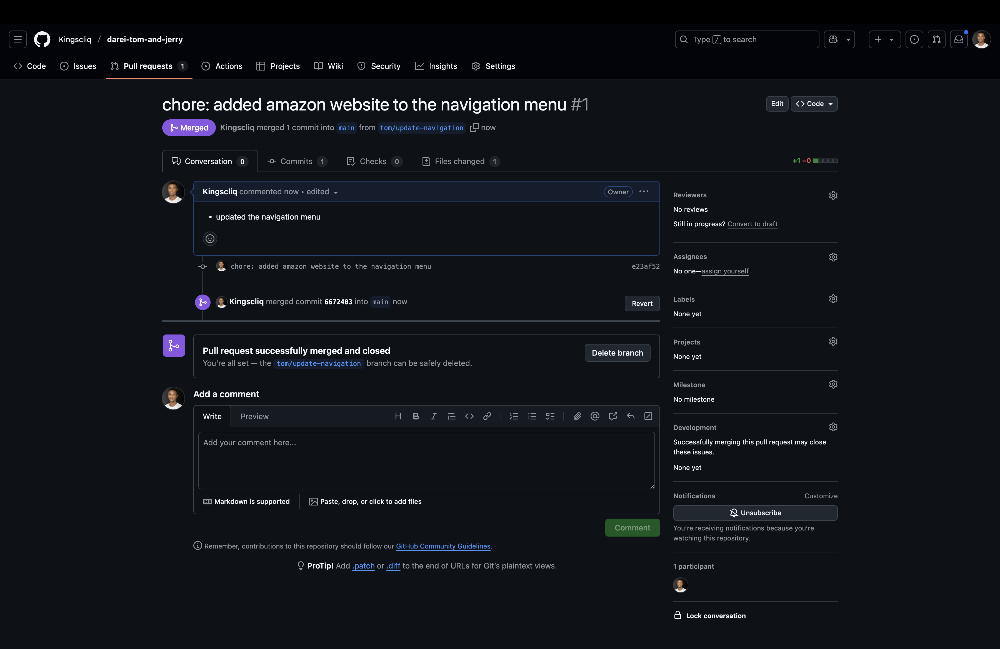
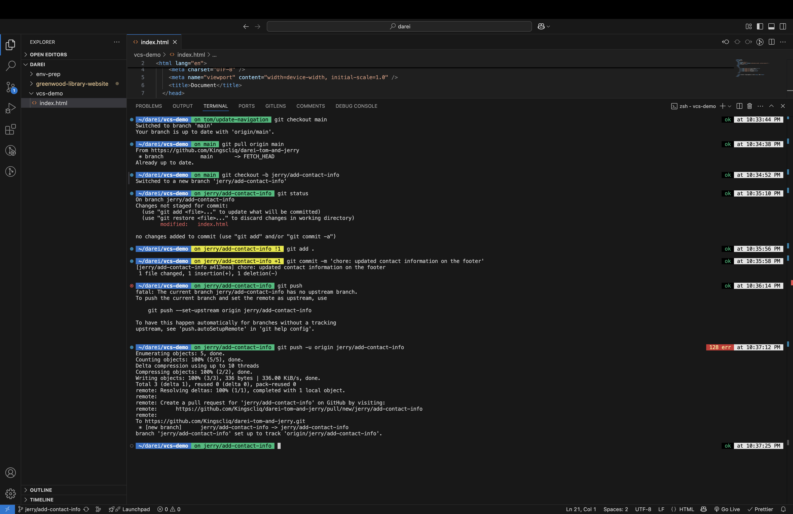
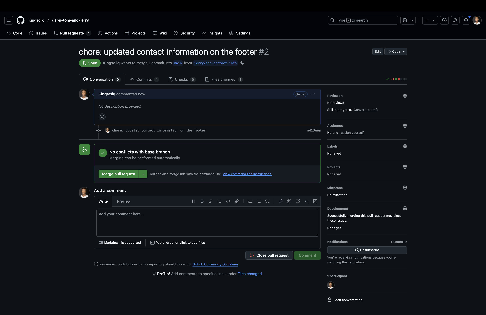
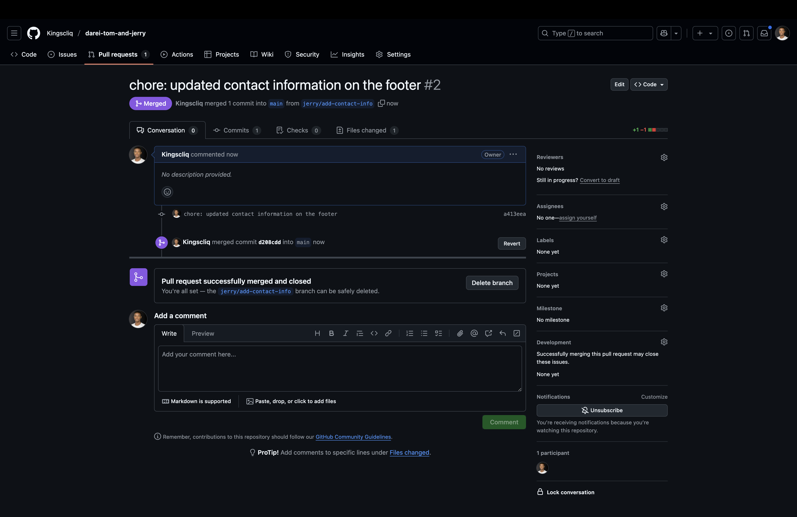

# Version Control System

This task outlines the use of version control systems to simulate contributions to code between team members: Tom, Jerry, and me.

#### Branches Created By

1. `main` - by me
2. `jerry/add-contact-info` - by Jerry
3. `tom/update-navigation` - by Tom

#### Contributors

1. Tom
2. Jerry
3. Kingsley

---

## 1. Screenshots of My Contributions

---

## 2. Screenshots of Tom's Contributions and Pull Requests

---

## 3. Screenshots of Jerry's Contributions and Pull Requests

---

## 4. Conclusion

I was able to successfully set up a Git repository, simulating the addition of Tom and Jerry, each making a contribution to the same file. Surprisingly, there were no merge conflicts. I guess Git has become even better at handling such scenarios!
