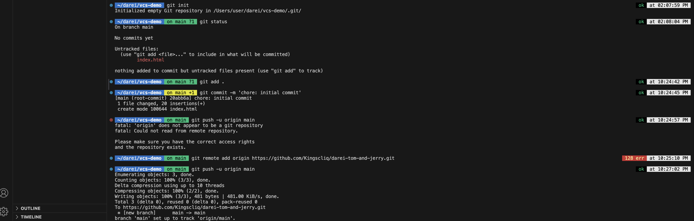
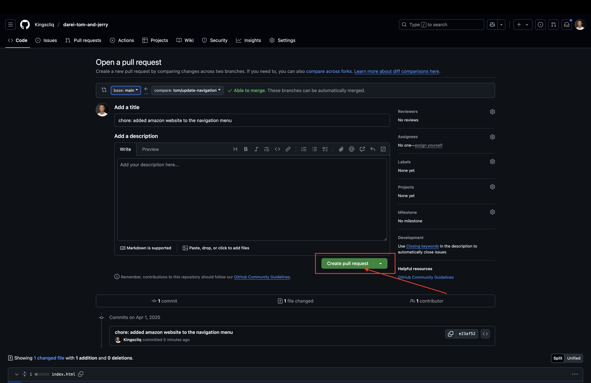

# Version Control System

This task outlines the use of version control systems to simulate contributions to code between team members: Tom, Jerry, and me.

#### Branches Created By

1. `main` - by me
2. `jerry/add-contact-info` - by Jerry
3. `tom/update-navigation` - by Tom

#### Contributors

1. Tom
2. Jerry
3. Kingsley

---

## 1. Screenshots of My Contributions

I ran the following git commands to i initialise the repo and added remote origin

**Intialise git repository**

```
git init
```

**Add all files to local repository**

```
git add .
```

**Commit files to local repository with a commit message**

```
git commit -m 'initial setup commit and creation of index.html file'
```

**Added remote origin**

```
git remote add origin https://github.com/Kingscliq/darei-tom-and-jerry.git
```

**Push files to remote main branch**

```
   git push -u origin main
```



---

## 2. Screenshots of Tom's Contributions and Pull Requests





---

## 3. Screenshots of Jerry's Contributions and Pull Requests


---

## 4. Conclusion

I was able to successfully set up a Git repository, simulating the addition of Tom and Jerry, each making a contribution to the same file. Surprisingly, there were no merge conflicts. I guess Git has become even better at handling such scenarios!
